# Inwestim MVP — Product Flows

> **Scope:** This document describes the **currently implemented** Inwestim MVP only.
> It documents behaviour observed in the codebase, not a roadmap.
>
> **Not documented as implemented features** (see [§14 Current Blockchain Boundary](#14-current-blockchain-boundary)):
> tokenized ownership and a secondary marketplace. Also not implemented: automated on-chain
> withdrawal payouts, KYC/AML, and server-side/private-RPC deposit verification. Where the
> blockchain is involved, transfers are **manual or admin-controlled** and are labelled as such.

---

## System overview

Inwestim is a Next.js (App Router) + Supabase real-estate investment platform. Investors
browse curated properties, request investments in USDC, and receive pro-rata rental
distributions. A platform **wallet ledger** tracks all money movements.

**Key architectural facts (as implemented):**

| Area | Implementation |
|---|---|
| Auth | Supabase Auth (email + password). Verification email sent by Supabase on sign-up. |
| Authorization | **Supabase Row Level Security (RLS) only.** There is **no service-role key** anywhere in the app — every read and write (including admin approvals and ledger inserts) runs through the anon/publishable key plus the current user's session. |
| Route protection | Per-page server-side guards (`supabase.auth.getUser()` → `redirect()`). There is **no `middleware.ts`**. |
| Writes | Performed by client components calling Supabase directly (`.from(...).insert/update`). There are **no Next.js server actions** (`"use server"`) and no `app/api` route handlers. |
| Wallet balance | **Derived**, never stored. `available = Σ(completed credits) − Σ(completed debits)` computed from `wallet_transactions`. There is no balance column. |
| Idempotency | Ledger inserts pre-check for an existing `wallet_transactions` row by `(reference_type, reference_id, type)` before inserting (application-level read-then-insert, not a DB constraint). |
| Atomicity | **No DB transactions.** Emulated with status-scoped updates, idempotent inserts, and best-effort rollback. |
| Blockchain | Polygon Mainnet (chainId 137), Circle USDC `0x3c499c542cEF5E3811e1192ce70d8cC03d5c3359` (6 decimals). Deposit verification is **read-only**. WalletConnect/Reown behind `NEXT_PUBLIC_ENABLE_WALLETCONNECT`. |

**Core tables:** `profiles`, `properties`, `property_documents`, `investments`,
`distribution_cycles`, `distribution_calculations`, `rental_distributions`,
`wallet_transactions`, `deposit_requests`, `withdrawal_requests`.

**Canonical status values:**

- `investments.status`: `pending` · `approved` · `rejected`
- `properties.status`: `draft` · `live` · `funded` · `exited`
- `distribution_cycles.status`: `draft` · `calculated` · `approved` · `paid` · `cancelled`
- `rental_distributions.status`: `pending` · `paid` · `failed` · `cancelled`
- `deposit_requests.status`: `pending` · `confirming` · `completed` · `failed` · `cancelled`
- `withdrawal_requests.status`: `pending` · `approved` · `completed` · `failed` · `cancelled`
- `wallet_transactions.status`: `pending` · `completed` · `failed`
- `wallet_transactions.type`: `deposit` · `investment` · `distribution` · `withdrawal` · `refund` · `adjustment`
- `wallet_transactions.direction`: `credit` · `debit`
- `wallet_transactions.reference_type`: `investment` · `rental_distribution` · `deposit_request` · `withdrawal_request`

---

## 1. User Registration and Authentication

Registration only creates a Supabase Auth user; the `profiles` row is created **lazily on
first dashboard access** (`ensureProfileExists`). Protected pages redirect unauthenticated
visitors to `/sign-in`.

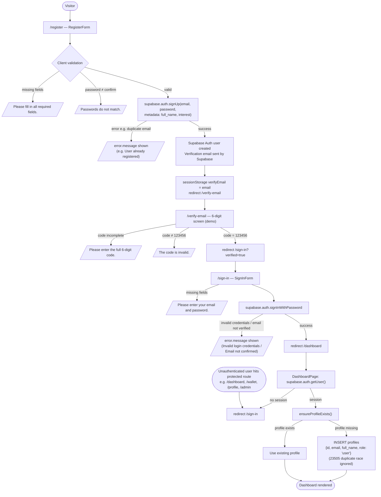

> **Note — the verify-email screen is a demo:** the `/verify-email` 6-digit form is a mock
> (accepts the fixed code `123456`) and is **not wired to Supabase OTP**. Supabase's own
> email-confirmation link is the real gate: if the project requires email confirmation,
> `signInWithPassword` returns `Email not confirmed` until the user clicks the emailed link.

---

## 2. Property Discovery

The public detail fetch (`getLivePropertyById`) filters `status = 'live'`, so
draft/funded/exited properties return `null` (404) publicly. Admins view every status
through the admin panel, which reads with no status filter.

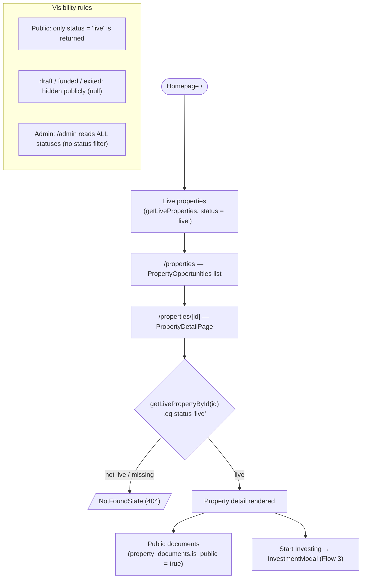

---

## 3. Investment Request

The investment form (`InvestmentModal`) is a client component. Logged-out users are
redirected to `/sign-in`. On confirm it inserts an `investments` row with `status =
'pending'`. Validation is client-side; the DB write is authorized by RLS.

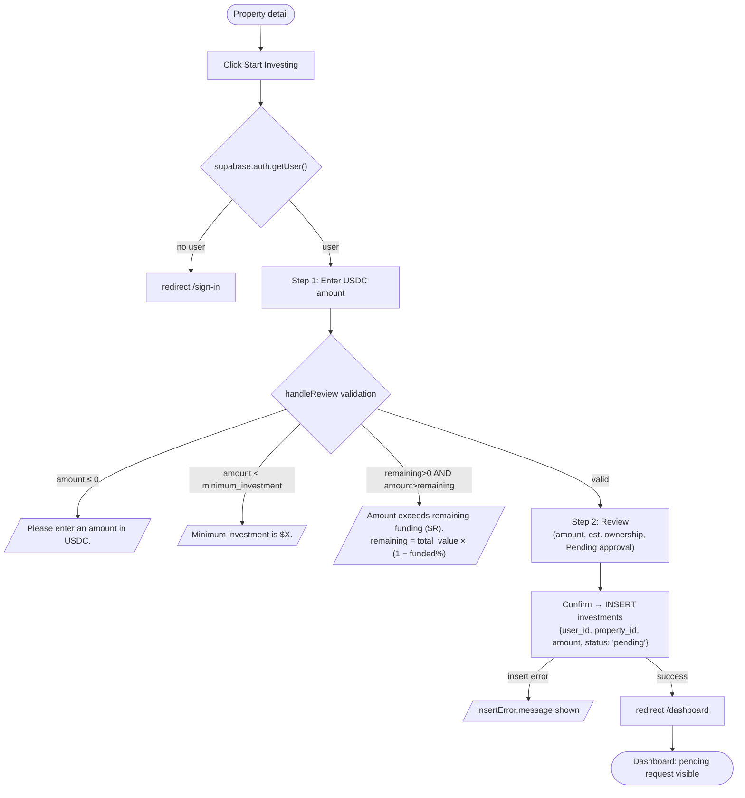

---

## 4. Investment Admin Approval

`InvestmentRequests` (admin, client component). Approve stamps timestamps, recalculates
property funding, and records an **idempotent** investment debit. Reject only sets the
status.

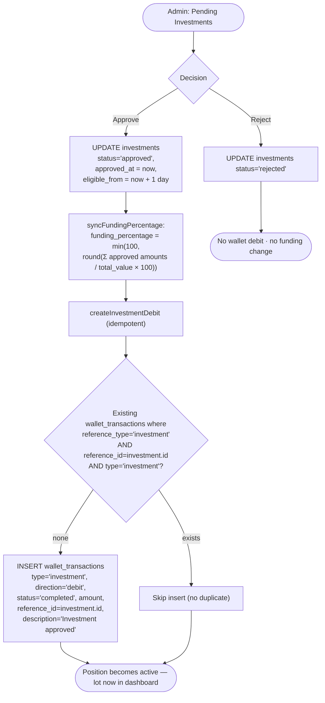

> **Idempotency note:** `createInvestmentDebit` pre-selects for an existing ledger row keyed
> on `(reference_type='investment', reference_id, type='investment')` and returns early if
> found. Re-approving (or a double-click) therefore does **not** create a second debit. The
> check is application-level (read-then-insert), not a DB uniqueness constraint. The debit is
> written with `status='completed'` immediately (in this model, approval = money already
> committed).
>
> **Caveat:** the investment status update itself is **not** status-guarded (`.eq("id", id)`
> only), so a re-approve re-stamps `approved_at`/`eligible_from`; the debit stays idempotent
> and funding recomputes idempotently.

---

## 5. Active Position / Multiple Purchase Lots

A user may invest in the same property many times. Each approval is a **separate lot** row
in `investments`. The dashboard groups approved lots by property for display; the position
detail page lists lots individually.

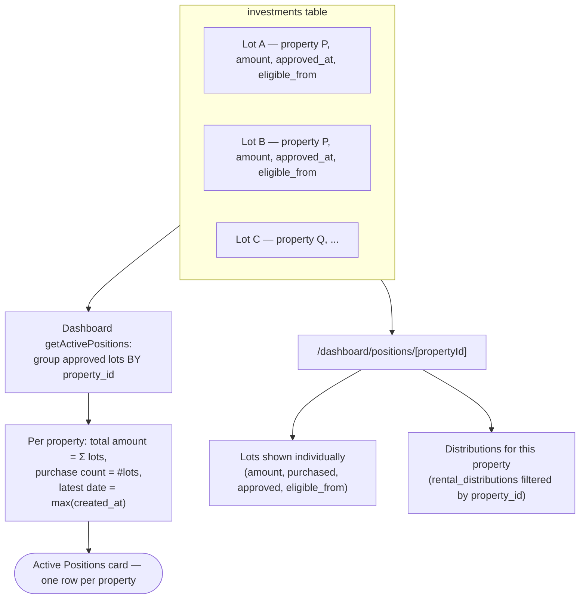

> Note: **Active Positions count = distinct properties** with ≥1 approved lot (not the
> number of lots). Portfolio Value = Σ of all approved lot amounts.

---

## 6. Distribution Cycle

`DistributionCycleForm` (admin). Net = gross − expenses. The pure math lives in
`lib/distribution.ts` (`calculateProrataDistribution`). Because there are no DB
transactions, inserts are ordered and a **best-effort rollback** deletes a half-built
cycle on failure.

**Business rule:** a lot becomes eligible one day after approval —
`eligible_from = approved_at + 1 day`.

**Eligible days** = overlap of:
- the lot's active range `[eligible_from, closed_at ?? period_end]`, with
- the cycle range `[period_start, period_end]`
(whole days, `floor`; 0 if no overlap or lot not yet eligible).

**Weight** = `investment amount × eligible days`.
**Share** = `lot weight / Σ all lot weights`; `calculated_amount = net × share` (rounded to
2dp, with the rounding remainder folded into the largest-weight lot so payouts sum exactly
to net).

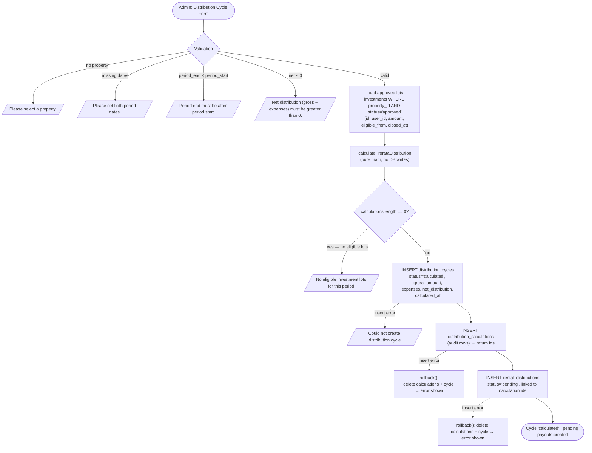

**Worked example (from `runDistributionExample`)** — 30-day period, net 1000 USDC:

| Lot | Amount | Eligible days | Weight | Share | Payout |
|---|---|---|---|---|---|
| A | 1000 | 30 (whole period) | 30000 | 0.6667 | 666.67 |
| B | 1000 | 15 (mid-period) | 15000 | 0.3333 | 333.33 |
| | | | **45000** | | **1000.00** |

> **Rollback limitation:** `rollback()` deletes `distribution_calculations` and the
> `distribution_cycles` row, but **not** `rental_distributions`. A partial payout insert can
> leave orphan payout rows behind (no transaction is available client-side).

---

## 7. Distribution Payment

`DistributionCycles` → **Mark as Paid** (shown only for `calculated` cycles). Payouts are
marked paid first (scoped to `status='pending'` so re-clicking is safe), then the cycle,
then one **idempotent** completed credit is inserted per paid payout.

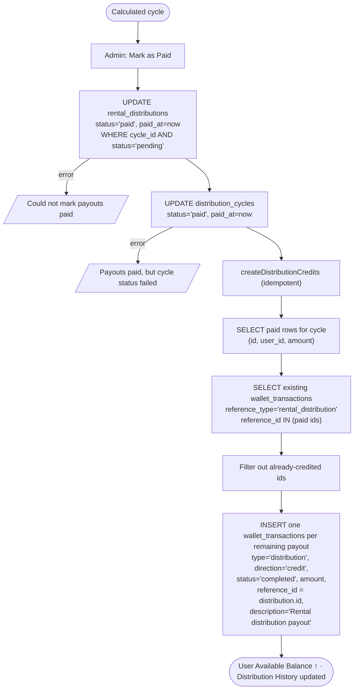

> **Idempotency & user separation:** credits are keyed per **payout row** (`reference_type =
> 'rental_distribution'`, `reference_id = rental_distribution.id`), one credit each, so every
> user's payout is a separate ledger entry. Re-running Mark as Paid credits only payouts that
> don't yet have a matching transaction. (This check keys on `reference_type` + `reference_id`
> only — it does not also filter on `type`.)

---

## 8. Wallet Ledger

There is **no stored balance column**. Balances are derived on every wallet-page render from
`wallet_transactions` scoped to the current user.

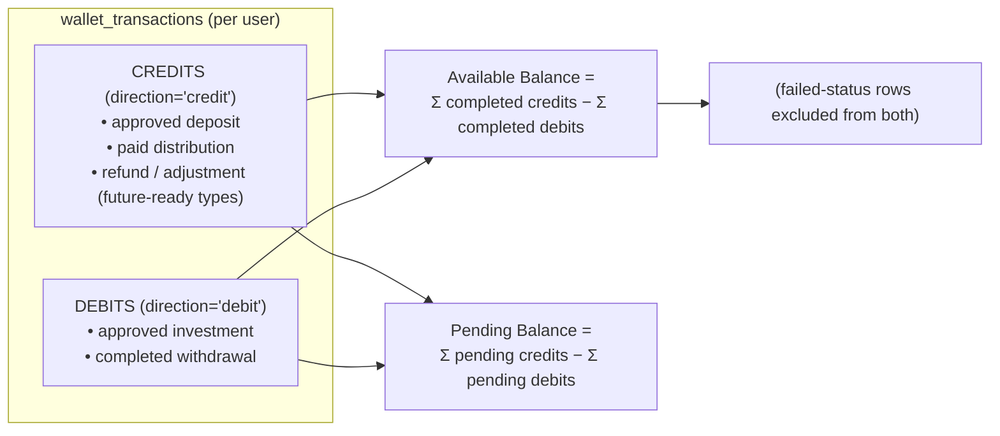

Signed amount per row: `amount × (direction === 'debit' ? −1 : +1)`. Rows with
`status='failed'` are ignored in both balances. A user only ever queries their own rows (and
RLS enforces the same). In practice all ledger rows in these flows are inserted directly as
`status='completed'` — the `pending` ledger state is future-ready but unused by current
write paths, so **Pending Balance is typically 0**.

---

## 9. Deposit Pipeline

Users send USDC to the treasury externally, then file a deposit request with the `tx_hash`.
An admin runs **read-only** on-chain verification, then **manually** approves; approval
inserts an idempotent completed credit. Verification is required before approval by default
(feature flag).

```mermaid
flowchart TD
    A([External wallet]) --> B["USDC transfer to treasury (off-app, manual)"]
    B --> C["Deposit request form<br/>(amount, wallet_address, chain, tx_hash*)"]
    C --> D{Duplicate tx_hash?}
    D -->|app pre-check or DB unique 23505| D1[/"This transaction hash was already submitted."/]
    D -->|new| E["INSERT deposit_requests status='pending'"]

    E --> F["Admin: Verify Tx (read-only)"]
    F --> G["verifyDepositTransaction (viem, read-only)"]
    G --> H{"All checks pass?"}
    H -->|yes| I["verification_status='verified'<br/>verification_details, verified_at"]
    H -->|no| J["verification_status='failed' (+ failing checks)"]

    I --> K{"Approve button enabled?<br/>NOT(REQUIRE_DEPOSIT_VERIFICATION)<br/>OR verification_status='verified'"}
    J --> K
    K -->|not verified & flag on| K1["Approve disabled —<br/>'Verification is required before approval.'"]
    K -->|verified (or flag off)| L["Admin: Approve → UPDATE deposit_requests<br/>status='completed', confirmed_at<br/>(guarded WHERE status='pending')"]
    L --> M["createDepositCredit (idempotent)"]
    M --> N{"Existing credit for this deposit?<br/>reference_type='deposit_request',<br/>reference_id, type='deposit'"}
    N -->|exists| N1["Skip"]
    N -->|none| O["INSERT wallet_transactions<br/>type='deposit', direction='credit',<br/>status='completed', description='Deposit approved'"]
    O --> P([Available Balance ↑])

    K -->|Admin: Reject| Q["UPDATE deposit_requests status='failed'<br/>(no credit created)"]
```

**Verification checks (`verifyDepositTransaction`, read-only):**
1. Treasury configured (`NEXT_PUBLIC_TREASURY_ADDRESS` set)
2. Transaction exists (receipt found on the active network)
3. Transaction succeeded (`receipt.status === 'success'`)
4. Minimum confirmations reached (`head − block + 1 ≥ MIN_DEPOSIT_CONFIRMATIONS`, default 12)
5. Network is Polygon (chainId 137)
6. Token is official Polygon USDC (`0x3c49…3359`)
7. Sender matches the request's wallet address
8. Recipient matches the treasury
9. Amount matches (`parseUnits(amount, 6)`)

**Deposit timeline states** (user view): Request submitted → Tx hash provided → On-chain
verification (`verified`/`failed`/pending) → Admin approval (`completed` vs
`failed`/`cancelled`) → Wallet credited.

> **Duplicate tx_hash:** the blockchain deposit form pre-checks and relies on a DB unique
> index (Postgres `23505`) to block a repeat submission at request time. In the admin panel,
> the "Duplicate tx" badge is **display-only** and does not block approval.
>
> **Manual / admin-controlled:** verification is **read-only** and never moves funds or
> auto-approves. The completed credit is created only by an explicit admin **Approve**.
> The verification gate is enforced in the UI (disabled button); it is not re-checked inside
> the approval mutation.

---

## 10. Withdrawal Pipeline

Users request a withdrawal against their available balance. Admin approval does **not** debit
the ledger. Only **Mark as Completed** debits — after re-checking the live balance. **No
actual on-chain payout is implemented** (see §14).

```mermaid
flowchart TD
    A([User: Withdrawal form]) --> B{Validation}
    B -->|amount ≤ 0| B1[/"Enter an amount greater than 0."/]
    B -->|amount > availableBalance| B2[/"Amount exceeds your available balance ($X)."/]
    B -->|no destination| B3[/"Enter the destination wallet address."/]
    B -->|valid| C["INSERT withdrawal_requests status='pending'"]

    C --> D{Admin decision}
    D -->|Reject (from pending)| D1["status='failed' — no debit"]
    D -->|Approve| E["UPDATE status='approved', approved_at<br/>(guarded WHERE status='pending')<br/>*** NO ledger debit yet ***"]
    E --> F{Admin action on approved}
    F -->|Cancel| F1["status='cancelled' — no debit"]
    F -->|Mark as Completed| G["Recompute available balance from ledger<br/>(Σ completed credits − debits)"]
    G --> H{"withdrawal.amount > available?"}
    H -->|yes| H1[/"Insufficient available balance at completion time."/]
    H -->|no| I["UPDATE status='completed', completed_at<br/>(guarded WHERE status='approved')"]
    I --> J["createWithdrawalDebit (idempotent)"]
    J --> K{"Existing debit?<br/>reference_type='withdrawal_request',<br/>reference_id, type='withdrawal'"}
    K -->|exists| K1["Skip"]
    K -->|none| L["INSERT wallet_transactions<br/>type='withdrawal', direction='debit',<br/>status='completed', description='Withdrawal completed'"]
    L --> M([Available Balance ↓])
```

> **Manual / admin-controlled — no real transfer:** completion records a **ledger debit
> only**. The actual blockchain USDC payout to the destination wallet is **not yet
> implemented**; an admin performs it out-of-band (or not at all in the MVP).
>
> Because the debit is created only at completion, two withdrawals can each be approved even
> though jointly they exceed the balance — each `markCompleted` re-checks `available` against
> the current ledger, so the second completion is blocked.

**Withdrawal timeline states** (user view): Request submitted → Admin approved → Payout
processing → terminal (Completed / Failed / Cancelled) → Wallet debited.

---

## 11. Treasury Reconciliation

`getTreasuryOverview` (admin, DB-only — **does not query the blockchain**) compares request
records against the ledger, for both deposits and withdrawals, and computes the net position.

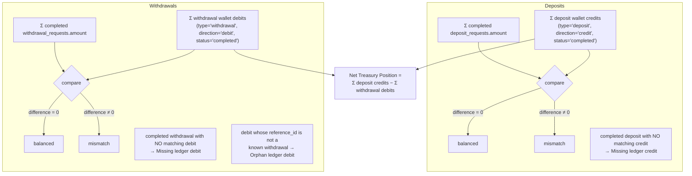

Differences are rounded to 6 dp to avoid float noise; exactly `0` → **balanced**. Missing and
orphan lists are capped at 5 rows each in the dashboard.

---

## 12. Property Document Management

`property_documents` rows carry a `document_type` and an `is_public` flag. Admins manage them
on the property edit page; the public detail page shows only `is_public = true`.

```mermaid
flowchart TD
    A([Admin: Property edit]) --> B["Add document<br/>title, file_url, document_type, is_public"]
    B --> C{Validation}
    C -->|empty title| C1[/"Enter a document title."/]
    C -->|empty URL| C2[/"Enter a file URL."/]
    C -->|valid| D["INSERT property_documents<br/>{property_id, title, document_type, file_url, is_public}"]
    D --> E["Admin list: ALL documents (public + private)"]

    F([Public: /properties/[id]]) --> G["getPublicPropertyDocuments<br/>.eq is_public true"]
    G --> H["Only public documents shown"]
    E --> I["Delete document by id (confirm)"]

    subgraph Types
      T["prospectus · appraisal · legal · insurance ·<br/>floor_plan · financial_report · other"]
    end
```

Private documents (`is_public = false`) are visible only in the admin panel (and RLS
restricts the public query to public rows).

---

## 13. Admin Access Control

`requireAdmin()` (server) guards every admin route using RLS-scoped reads only. It gates
**page rendering** — the individual admin mutations rely on RLS at the DB level.

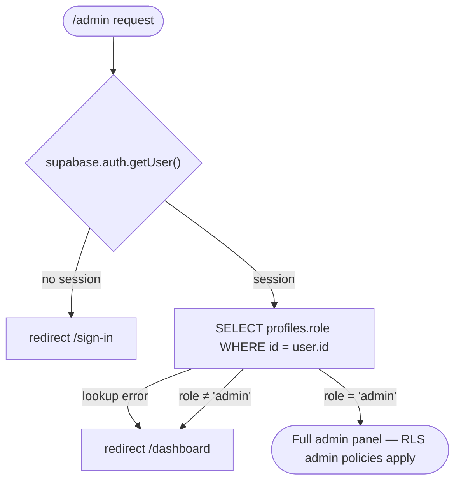

- **Unauthenticated →** `/sign-in`
- **Authenticated non-admin →** `/dashboard`
- **Admin →** full access; every admin data query still runs as the user (no service role),
  so admin RLS policies must permit the reads/writes.

---

## 14. Current Blockchain Boundary

This is the honest boundary of what the blockchain layer does **today**:

| Capability | Status |
|---|---|
| Polygon Mainnet configuration (chainId 137, Circle USDC 6dp) | ✅ Configured (`lib/web3/networks.ts`) |
| WalletConnect / Reown (wagmi) integration | ⚙️ Behind `NEXT_PUBLIC_ENABLE_WALLETCONNECT` flag; when on, used for **read-only** external-wallet identity + the on-chain deposit form |
| Deposit on-chain verification | 🔍 **Read-only** (`getTransactionReceipt` + Transfer-log inspection). Never moves funds, never auto-approves |
| Admin approval | 🛑 **Final and manual** — the completed ledger credit is created only by an explicit admin Approve |
| Automated on-chain withdrawal payout | ❌ **Not implemented** — completion writes a ledger debit only; the real transfer is out-of-band / admin-controlled |
| Tokenized ownership | ❌ **Not implemented** |
| Secondary marketplace | ❌ **Not implemented** |
| KYC / AML | ❌ **Not implemented** |
| Server-side / private-RPC verification | ❌ **Not implemented** (verification runs client-side against a public/registry RPC) |

### High-level architecture

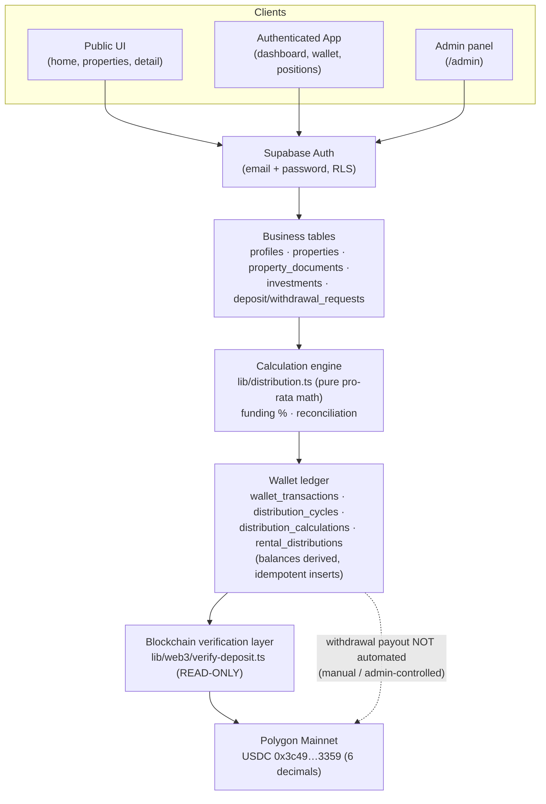

Solid arrows are implemented paths. The dashed arrow marks the **manual / admin-controlled**
gap: no automated on-chain withdrawal transfer exists.
